# **Lab 12: Create an AI-assisted customer journey with Copilot in Customer Insights - Journeys**

**Objective**: In this lab, you will learn how to use Copilot in Customer Insights – Journeys to automatically build an AI-assisted customer journey. You will learn how to generate a multi-step journey from a natural language prompt, create and configure a segment, review Copilot-generated journey steps, assign emails to journey activities, configure journey frequency and start times, and publish a complete automated journey.

## **Exercise 1: Using the journey copilot**

Now, let's imagine you want to create a welcome journey for people who
recently joined your program. To create a journey with Copilot,

1.  Navigate to the **Customer Insights - Journeys** portal.

2.  Select the **Journey** tab under **Engagement**.

   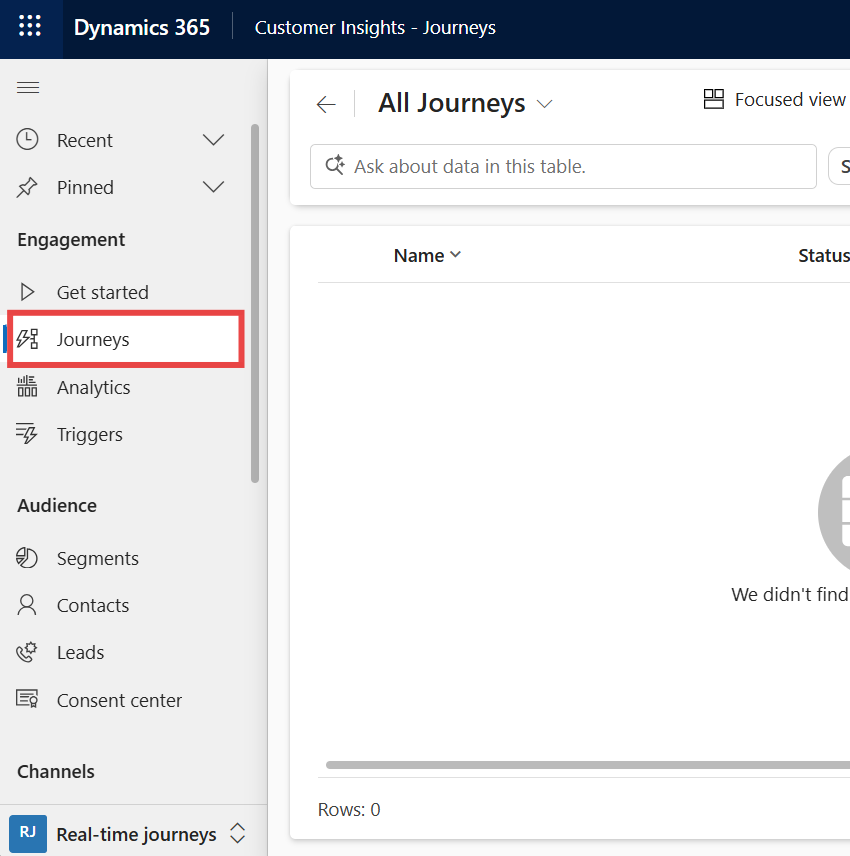

3.  Then select **New Journey**, which opens the journey copilot window.

   

4.  Enter !!Create a journey that will send a welcome email to all customers that are part of the MySegment segment. After       two days, send them an exclusive offer email!!. And then select the **Send** icon.

    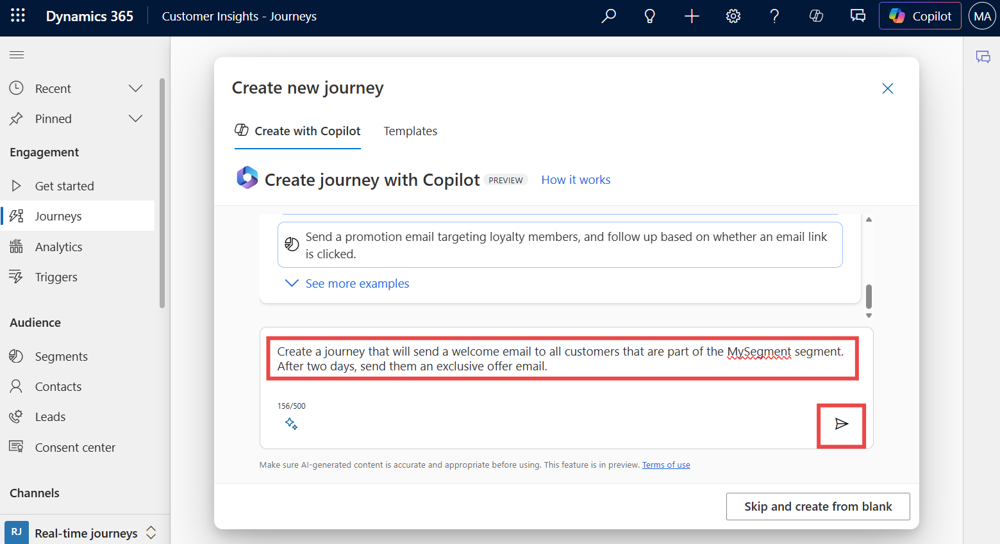

5.  Copilot processes the prompt and asks to select Segment. To create a
    segment, click on the field given to enter the segment name and then
    select **+ New**.

    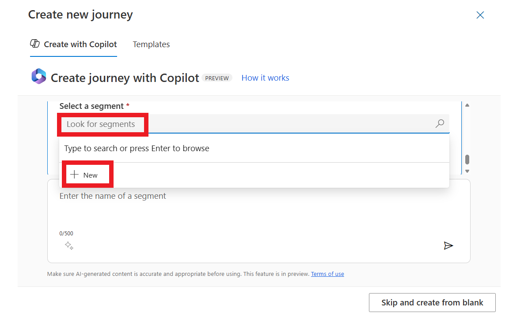

6.  Name the segment as !!**MySegment**!! and select **Contact** a
    target audience.

    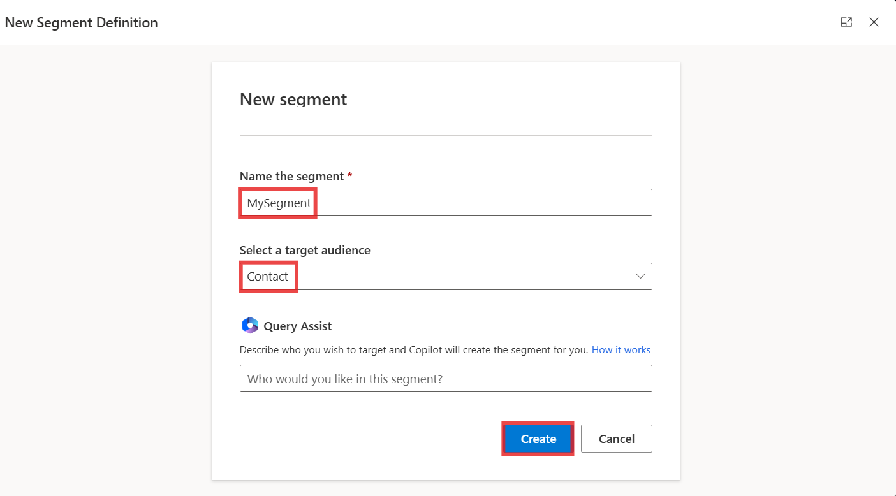

7.  Select **Save**. If this gives you an error, ignore it and go to the
    next step without saving.

    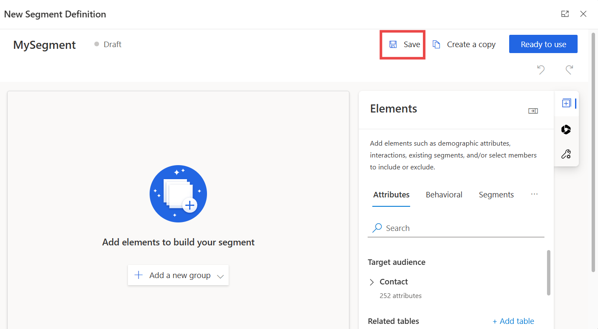

8.  Under the **Elements** pane, select more options (3 dots) next to
    segments and then select **Include Contacts.**

    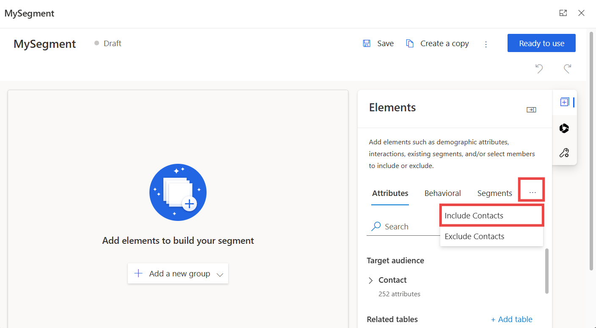

9.  Click on the **first contact** under the Include member panel.

    

10. You can see the contact is added on the left side under Include
    contacts.

    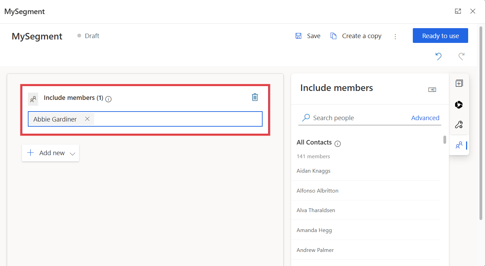

11. Select **Save**.

    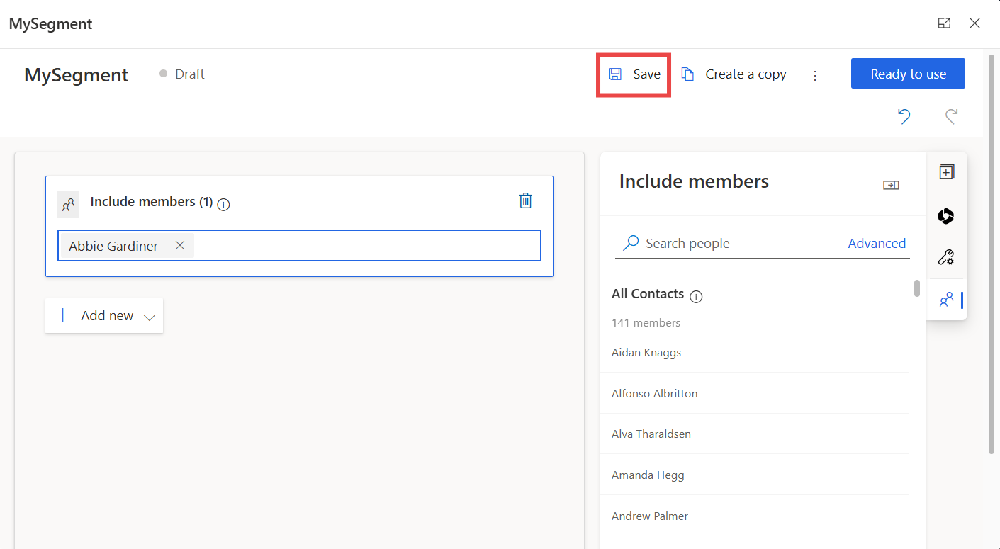

12. Select **Ready to use**. Close the MySegment pane.

    
   
    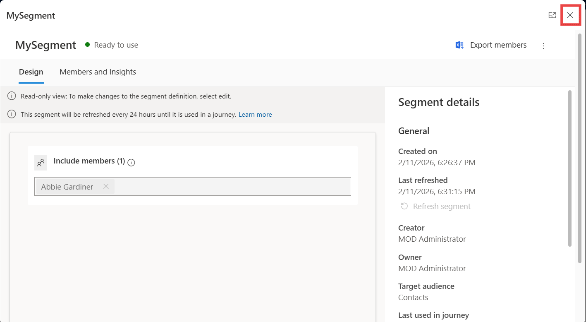

13. Now again execute the New Journey creating step, enter the previous prompt. It automatically detected the segment and        each subsequent step clearly.

    !!Create a journey that will send a welcome email to all customers that are part of the MySegment segment. After two days, send them an exclusive offer email.!!
   
    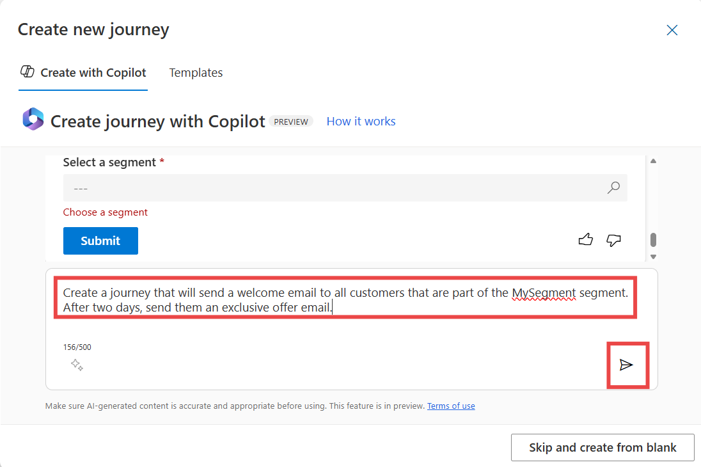

14. Select **Update this journey**.

    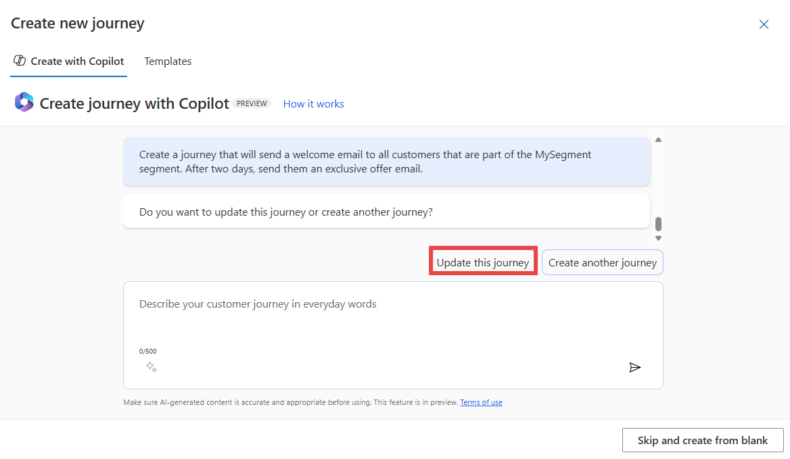

15. Once you're satisfied with the suggested journey, select **Create
    journey**, and the journey will be automatically created for you.
    You can use the icon for **thumbs up** and **thumbs down** on the
    right side to provide feedback on the copilot and help it improve
    over time.

    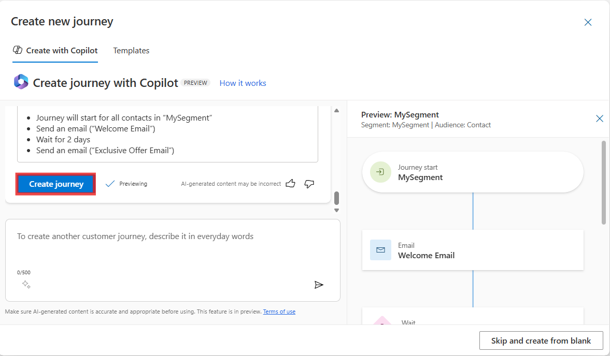

16. Select **MySegment** step. Select the frequency as **one time journey
    with a static audience** and select the **future time** for the
    start time journey.

    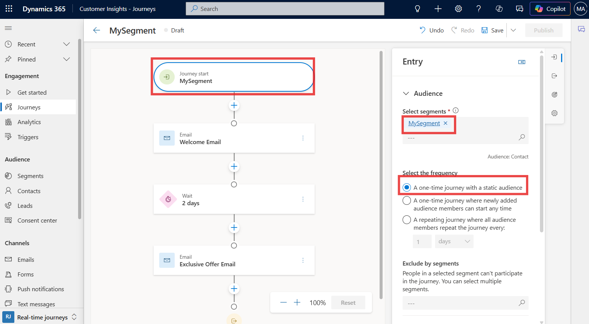

    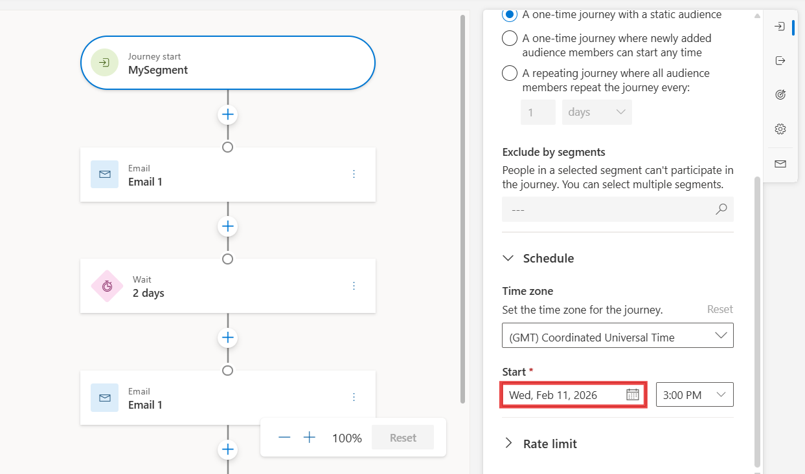

17. Select **Welcome Email** (second step). Click in the **Select
    email** field and select **Email 1**.

    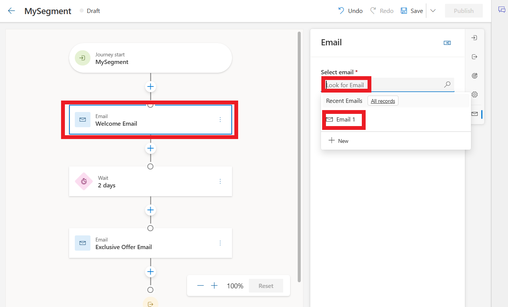

18. Select **Exclusive offer** (fourth step). Click in the **Select
    email** field and select **Email 1**.

    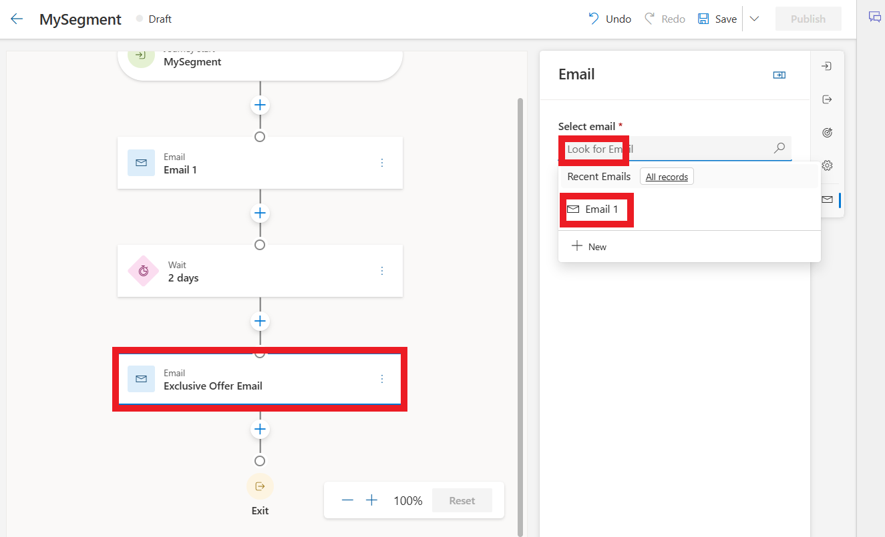

19. Select **Save**.

    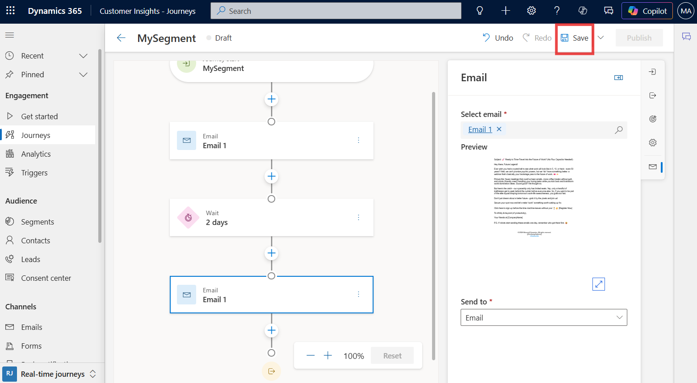

20. Select **Publish**.

    
   
    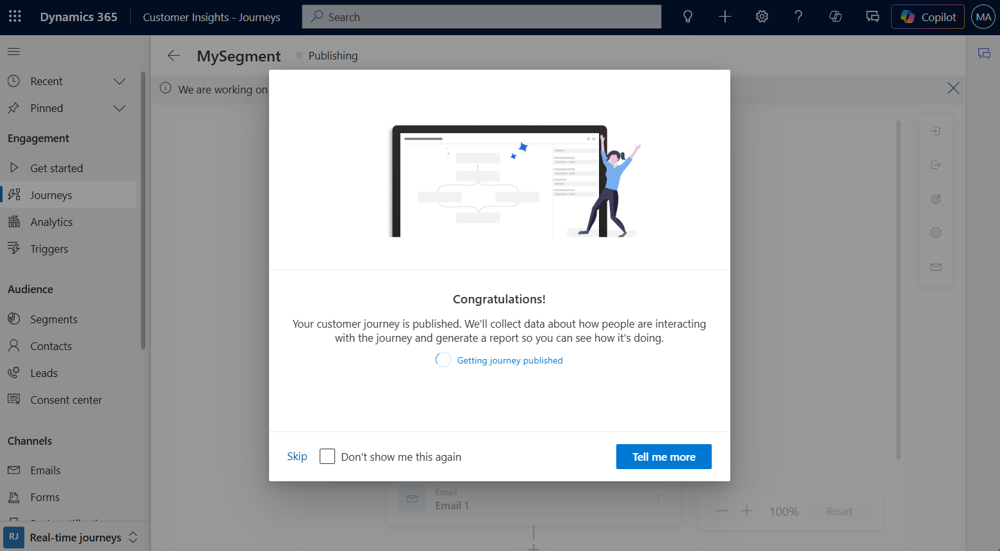

**Summary**: In this lab, you learned how to generate a journey from a text prompt and create the supporting segment (MySegment). You reviewed and updated the Copilot-generated journey, assigned the required emails to each step, set scheduling parameters, and published the final journey. 

