# **Lab 14: Use Finance agents in Microsoft 365 Outlook**

**Objective**: In this lab, you will learn how to activate the Finance app, use demo mode to generate AI-powered email summaries, view ERP-linked customer details, and add notes directly from Outlook. Finance agents integrate Outlook with ERP data to streamline financial review and communication workflows.

## **Exercise 1: Install Finance agents in Microsoft 365 Outlook from the Microsoft 365 admin center**

You have alredy installed Finance agents in Microsoft 365 Outlook in the Lab 0 > Exercise 7.

## **Exercise 2: Generating email summary in Demo mode, viewing contact details and adding notes**

1.  To open **Outlook**, select the **App** **launcher** icon in the
    top-left corner of the Microsoft 365 admin center and then select
    **Outlook**.

     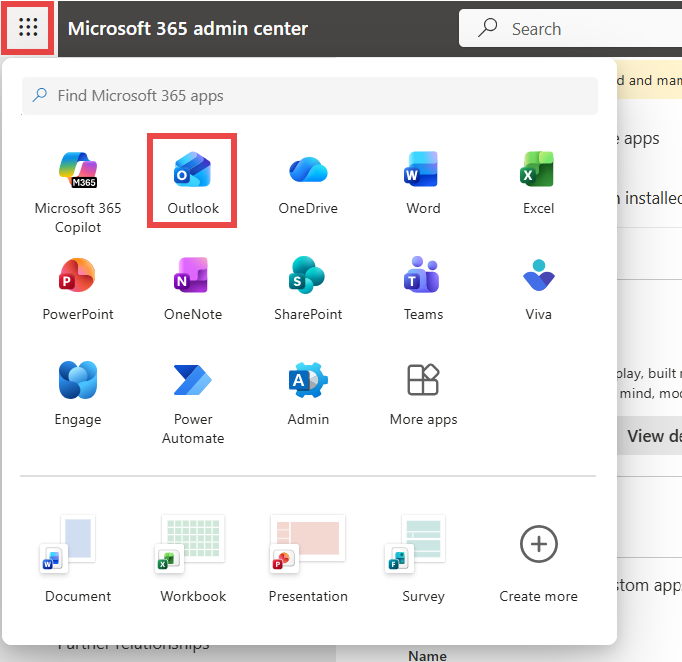

2.  Open any mail, click on **Apps**, and then click on **Add apps**.

     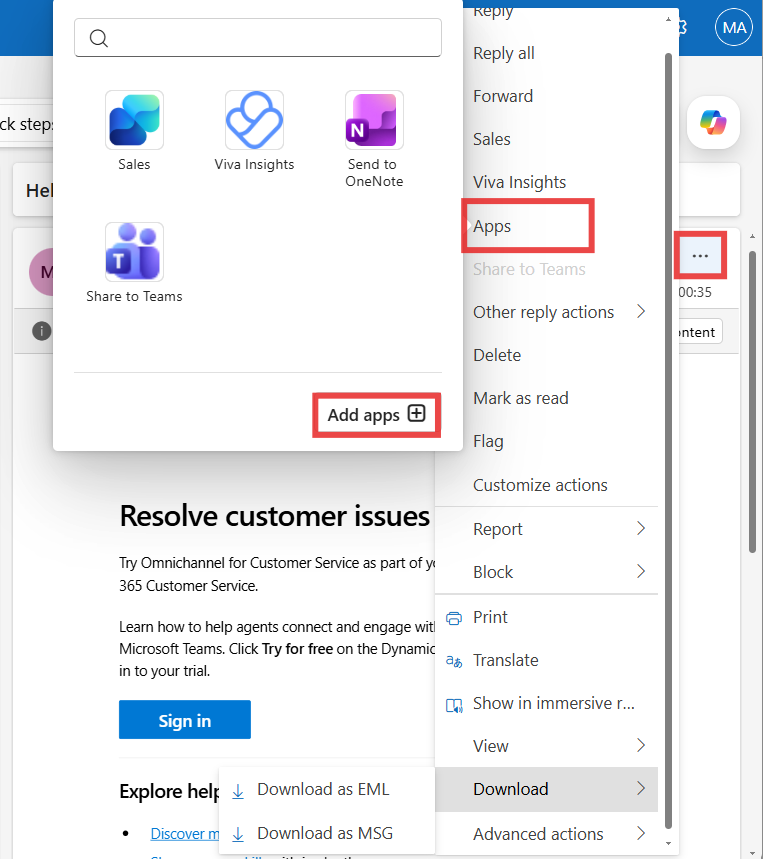

3.  In the search bar, type **Finance** and then select it from the
    **Apps** list.

     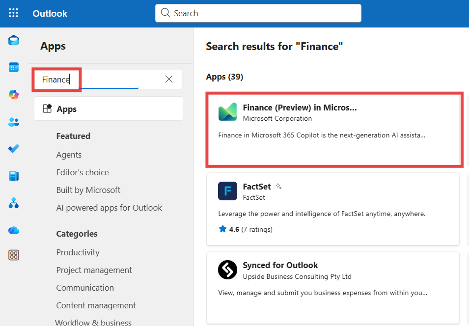

4.  Select **Add**.

     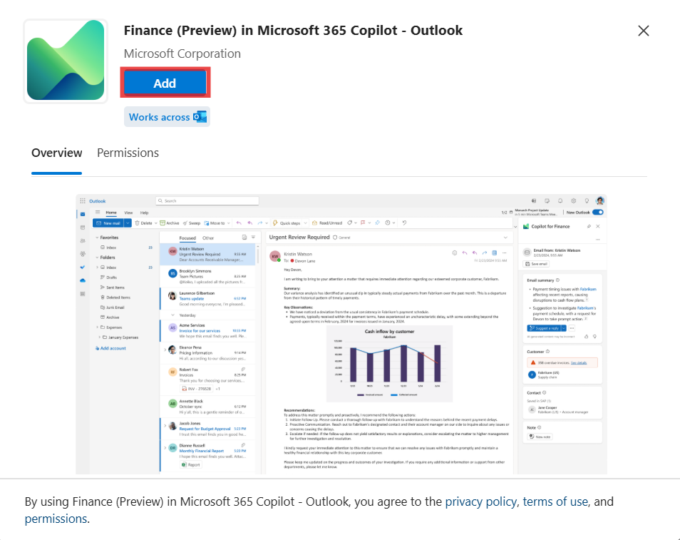

5.  If a pop-up appears, click **Got it** to start using the **Finance**
    app else ignore the step.

     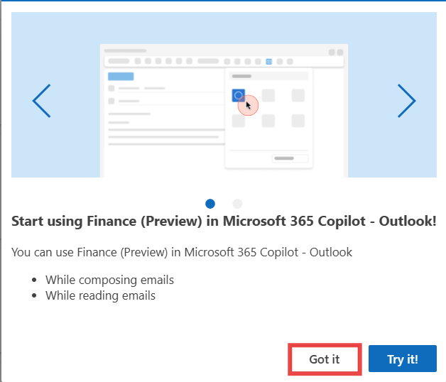

6.  Now go back to the inbox by selecting the **Mail** icon from the
    left navigation pane.

     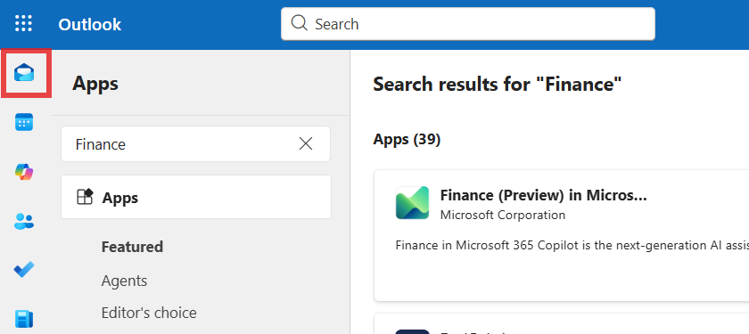

7.  Open any email that you want to analyze. On the top menu for the
    selected email, select **All Apps**. Select the **Finance
    (Preview)** **in Microsoft 365 Copilot -Outlook** app.

     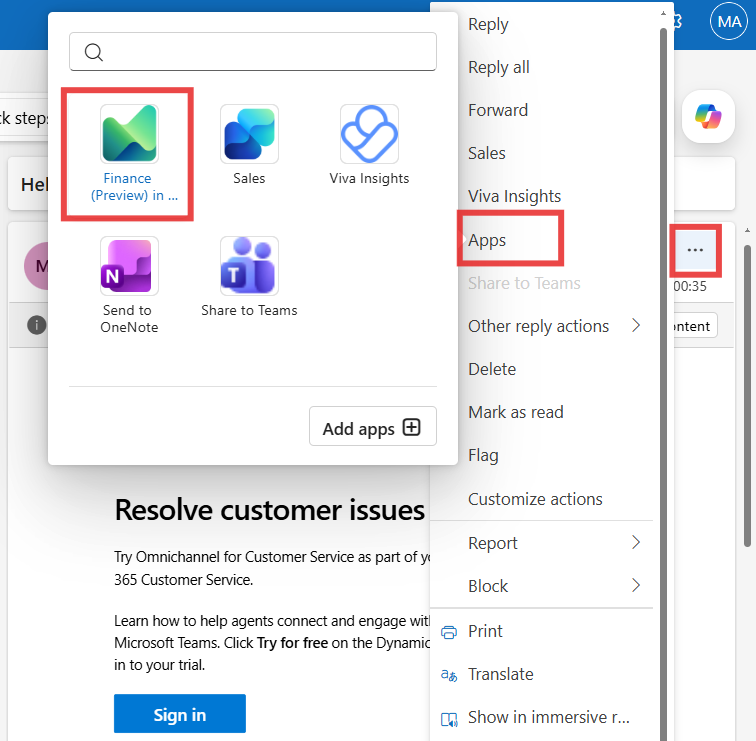

8.  On the **Welcome** page, select **Try demo mode**.

     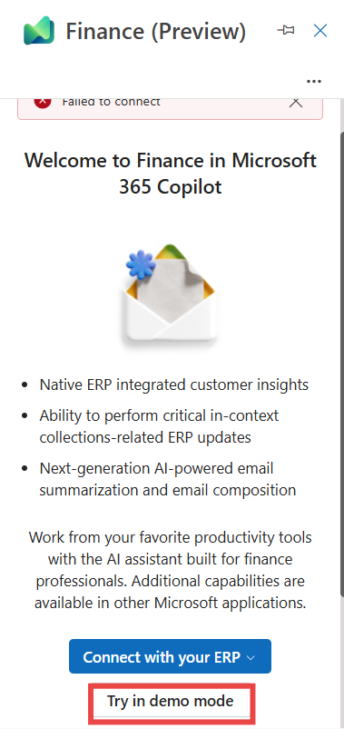

9.  Click **Next** on the pop-up window of **Stay in the flow of your
    work**. Click **Next** until you reach the **Try now** button.

     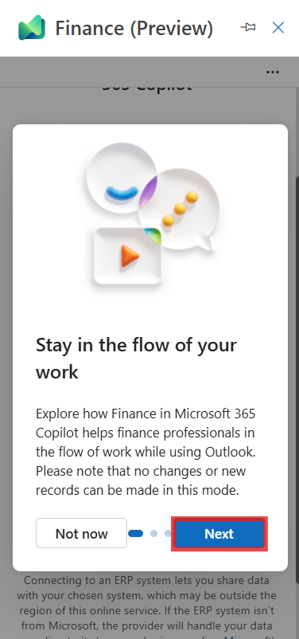

10. When you see the **Try now** button, click on that.

     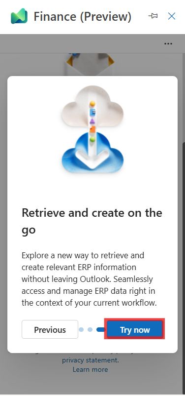

11. You can see **Email summary**.

     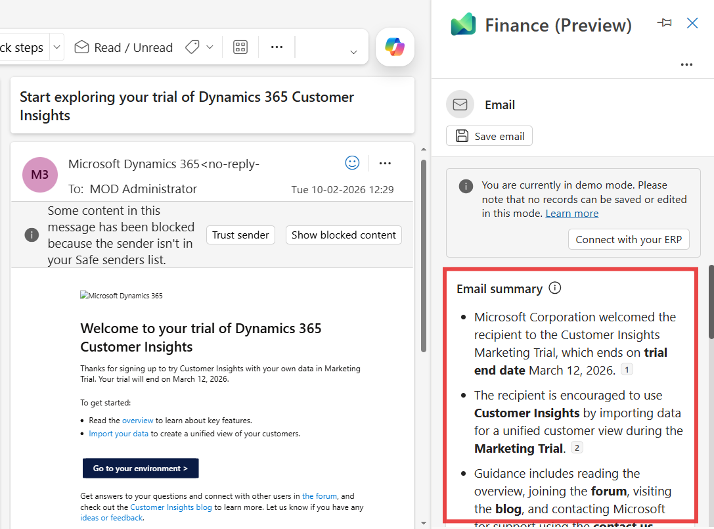

12. If you want suggestions to reply to the email, click on **Suggest a
    reply**. To save, regenerate, or copy the email summary, click on 3
    dots (**...**) next to Suggest a reply.

     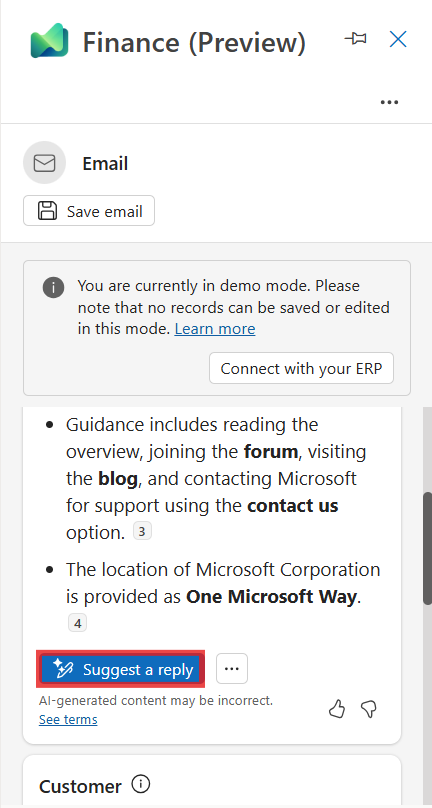

13. You can also see the customers and contacts saved in your ERP.

     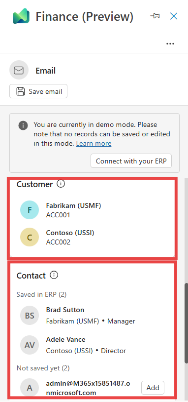

14. Click on the customer’s name, **Fabrikam**.

     

15. You can see the customer details, outstanding invoices and related
    activities.

     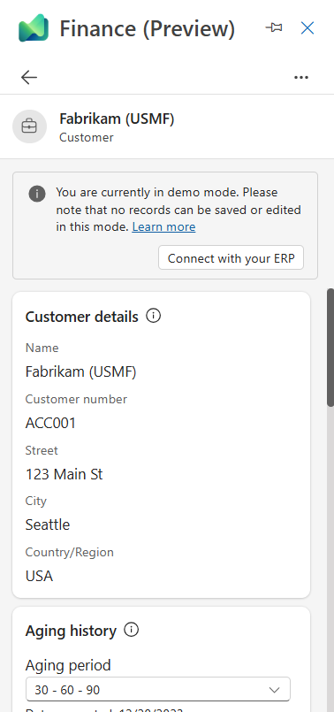

16. Click on the **back arrow** to come back to the home screen.

     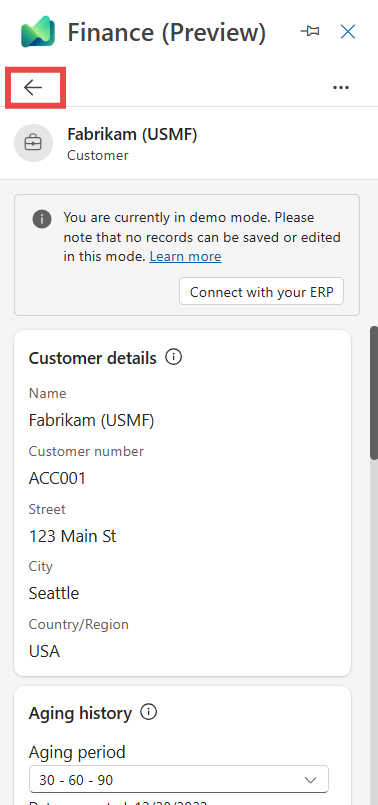

17. Now scroll down and select **New note** under the section at the
    end.

     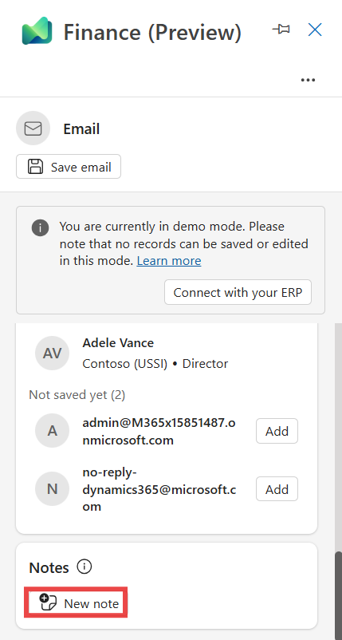

18. You can save the note by selecting the customer that you want to
    associate the note with.

**Summary**: In this lab, you learned how to deploy Finance agents from the Integrated Apps section of the Microsoft 365 admin center and make them available across your organization. You then used the Finance agent inside Outlook to generate email summaries, explore suggested replies, view customer and contact information synced from your ERP system, and create notes associated with a selected customer. 

